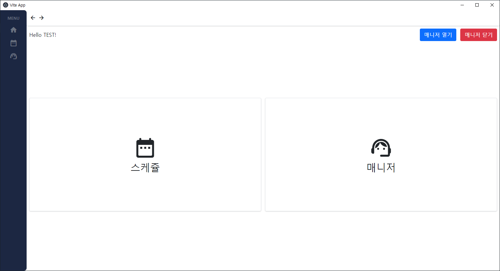
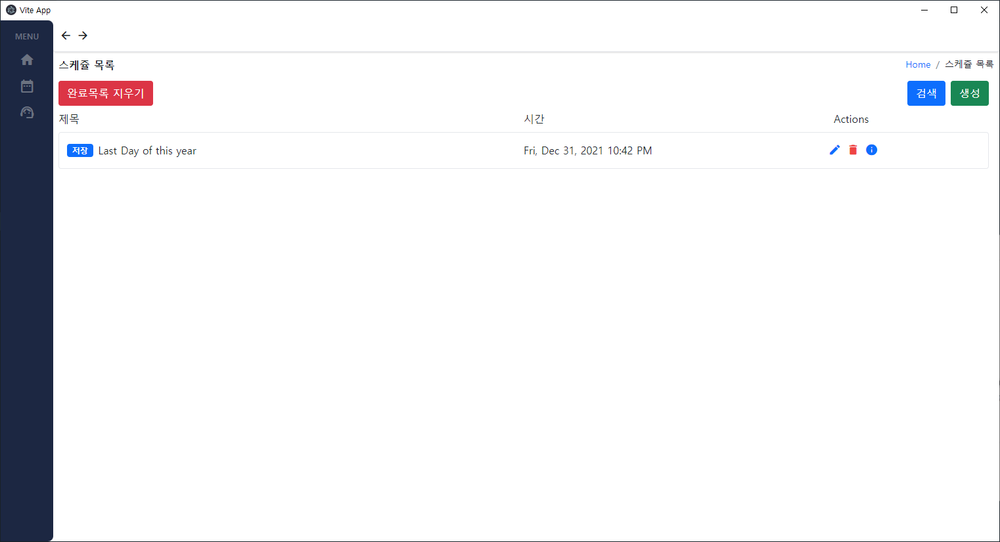
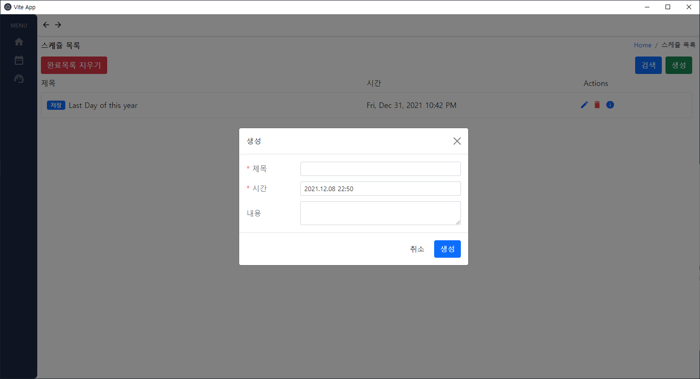
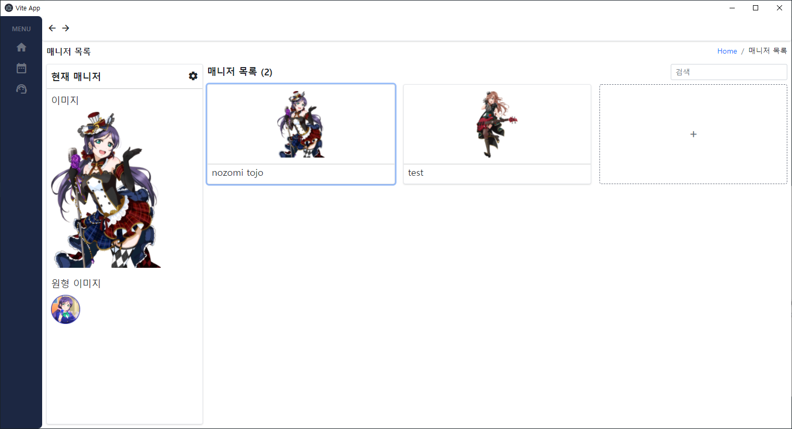
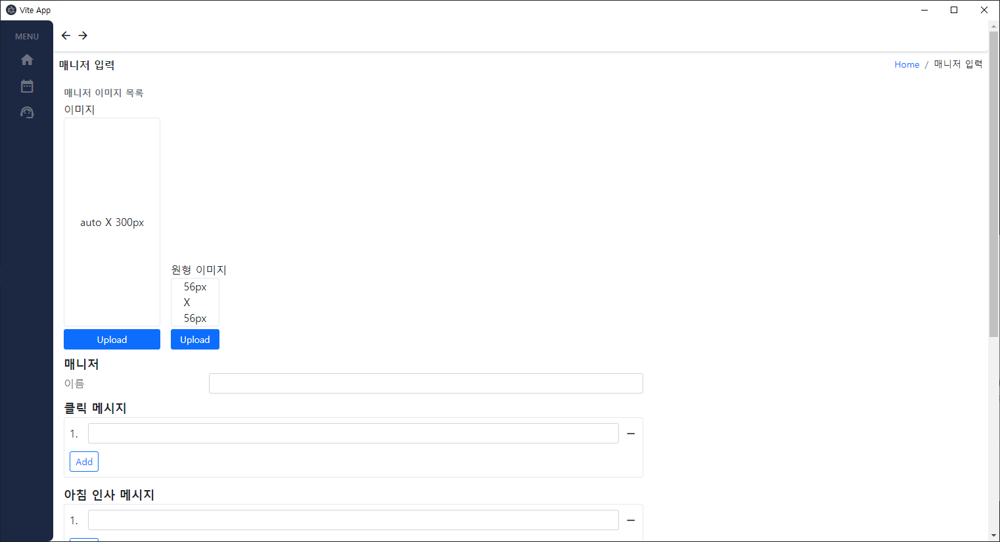
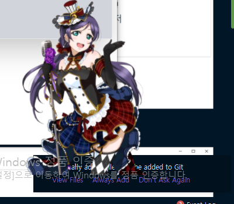
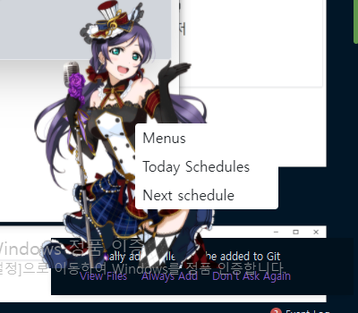

# My personal manager

## Tech stacks
1. Vue 3
2. Typescript
3. Electron
4. Vite

## Screenshots
### Home

### Schedule

### Manager Base

### Manager

## Version history
| Version   |     content      |  updatedAt |
|----------|:-------------:|------:|
| 1.0 |  Open | 2021-12-08 |

## Next... maybe?
1. Set english dictionary and korean dictionary
2. Finish Manager config 
3. Fix the bugs
4. Add more message input!
   1. Finish the already created messages to form and info!
